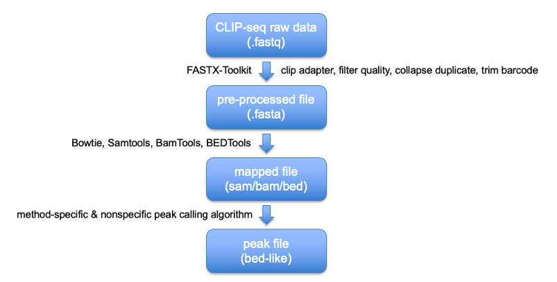

# Process pipeline for POSTAR3 high-throughput data

### CLIP-seq

#### Overview




#### Downloading data and dumping sra file

**Software**: SRA Toolkit

**Steps**:

1. Download using prefetch
2. Judging the sequencing file was single-end or pair-end
3. Dumping sra file to obtain fastq file

**Code**:

```bash
# 1. Download sra file

prefetch \
-v \ # verbose mode
-t both \ # transport mode (both: first try ascp, which was faster but not all data could be downloaded in this way; if not able to download with ascp, then try http; ascp; http)
-a "/Share2/home/lulab1/.aspera/connect/bin/ascp|/Share2/home/lulab1/.aspera/connect/etc/asperaweb_id_dsa.openssh" \ # ascp program path (universal for all download)
-O /Share2/home/lulab1/POSTAR3/RBP_CLIP/${species}/0.raw/${directory_name}/ \ # output directory
${run_number}

# 2. Judging SE or PE (4 for SE, and 8 for PE)

fastq-dump -X 1 --split-spot -Z ${run_number}.sra | wc -l

# 3. Dumping sra file to fastq file

fastq-dump ${run_number}.sra # for SE
fastq-dump --split-3 ${run_number}.sra # for PE (also works for SE)
```


####  Pre-processing

**Software**: FASTX-Toolkit

**Steps**: 

1.  Adapter clipping
2. Quality filtering
3. PCR duplicate collapsing
4. Barcode trimming (for some data, especially iCLIP-related technologies)

##### Code

```bash
# Pre-processing script (Position: /BioII/lulab_b/zhaoweihao/project/POSTAR3/RBP_CLIP/scripts/1.pre.sh)

# 1. clip adapter

/Share2/home/lulab/zhuyumin/apps0/fastx/fastx_clipper \
-a ${adapter} \ # Input adapter sequence
-l 13 \ # Discard sequence less than 13nt after clipping
-Q 33 \ # Use Phred33 quality score
-v \ # Use verbose mode
-i /Share2/home/lulab1/POSTAR3/RBP_CLIP/${species}/0.raw/${dataset_name}/${run_number}.fastq \ # Input fastq file
-o /BioII/lulab_b/zhaoweihao/project/POSTAR3/RBP_CLIP/${species}/1.pre/${dataset_name}/${run_number}.clipped.fastq # Output fastq file

# 2. filter quality

/Share2/home/lulab/zhuyumin/apps0/fastx/fastq_quality_filter \
-q 20 \ # Quality more than 20 will be considered as high quality
-p 80 \ # Only reads with more than 80% of bases that are of high quality will be kept
-Q 33 \
-v \ 
-i /BioII/lulab_b/zhaoweihao/project/POSTAR3/RBP_CLIP/${species}/1.pre/${dataset_name}/${run_number}.clipped.fastq \ # Input fastq file
-o /BioII/lulab_b/zhaoweihao/project/POSTAR3/RBP_CLIP/${species}/1.pre/${dataset_name}/${run_number}.clipped.filtered.fastq # Output fastq file

# 3. collapse duplicate

/Share2/home/lulab/zhuyumin/apps0/fastx/fastx_collapser \
-Q 33 \
-v \
-i /BioII/lulab_b/zhaoweihao/project/POSTAR3/RBP_CLIP/${species}/1.pre/${dataset_name}/${run_number}.clipped.filtered.fastq \ # Input fastq file
-o /BioII/lulab_b/zhaoweihao/project/POSTAR3/RBP_CLIP/${species}/1.pre/${dataset_name}/${run_number}.clipped.filtered.collapsed.fa # Output fasta file (duplicate removal will lose quality score)

# 4. barcode removal (fastqc could reveal same nucleotide at 5' end)

/Share2/home/lulab/zhuyumin/apps0/fastx/fastx_trimmer \
-f ${barcode_length} \ # length of the same nucleotide + 1 (first base to keep)
-v \
-i /BioII/lulab_b/zhaoweihao/project/POSTAR3/RBP_CLIP/${species}/1.pre/${dataset_name}/${run_number}.clipped.filtered.collapsed.fa \ # Input fasta file
-o /BioII/lulab_b/zhaoweihao/project/POSTAR3/RBP_CLIP/${species}/1.pre/${dataset_name}/${run_number}.clipped.filtered.collapsed.trimmed.fa # Output fasta file
```


#### Mapping using bowtie

**Software**: Bowtie, Samtools, BAMTools, BEDTools

**Steps**: 

1. Mapping (using Bowtie) -> .sam file
2. Convert sam to bam (using Samtools) -> .bam file
3. Create index for bam (using BAMTools) -> .bam.bai file
4. Convert bam to bed (using BEDTools) -> .bed file

**Code**:

```bash
# Mapping script (Position: /BioII/lulab_b/zhaoweihao/project/POSTAR3/RBP_CLIP/scripts/2.map_bowtie.sh)

# 1. Map sequence using bowtie

/BioII/lulab_b/zhaoweihao/app/bowtie/bowtie \
-f \ # Input fasta file
-v 2 \ # no more than 2 mismatches
-m 1 \ # no more than 1 alignment (no multi-alignment)
--best \ # report best stratum
--strata \ # not report other strata
--sam \ # output sam file
${GENOME} \ # genome index file
/BioII/lulab_b/zhaoweihao/project/POSTAR3/RBP_CLIP/${species}/1.pre/${dataset_name}/${run_number}.clipped.filtered.collapsed.fa \ # Input pre-processed fasta file
/BioII/lulab_b/zhaoweihao/project/POSTAR3/RBP_CLIP/${species}/2.map_bowtie/${dataset_name}/${run_number}.sam # Output sam file

# 2. Convert sam to bam using Samtools

samtools sort /BioII/lulab_b/zhaoweihao/project/POSTAR3/RBP_CLIP/${species}/2.map_bowtie/${dataset_name}/${run_number}.sam > /BioII/lulab_b/zhaoweihao/project/POSTAR3/RBP_CLIP/${species}/2.map_bowtie/${dataset_name}/${run_number}.bam

# 3. Create index for bam using BAMTools

bamtools index -in /BioII/lulab_b/zhaoweihao/project/POSTAR3/RBP_CLIP/${species}/2.map_bowtie/${dataset_name}/${run_number}.bam

# 4. Convert bam to bed using BEDTools

bedtools bamtobed -i /BioII/lulab_b/zhaoweihao/project/POSTAR3/RBP_CLIP/${species}/2.map_bowtie/${dataset_name}/${run_number}.bam > /BioII/lulab_b/zhaoweihao/project/POSTAR3/RBP_CLIP/${species}/2.map_bowtie/${dataset_name}/${run_number}.bed
```


#### Mapping using Novoalign

**Software**: Novoalign

**Code**:

```bash
# Mapping script (Position: /BioII/lulab_b/zhaoweihao/project/POSTAR3/RBP_CLIP/scripts/2.map_novoalign.sh)

/Share2/home/lulab/zhuyumin/share/zhuyumin/apps/novocraft/novoalign \
-F FA \ # Input fasta file
-t 85 \ # maximum alignment score acceptable for best alignment
-l 25 \ # minimum information content for a read in base pairs
-r None \ # limit of maximum number of alignment number reported per read
-o Native \ # report format
-d ${GENOME} \ # reference genome of novoalign (Position: /Share2/home/lulab/zhuyumin/share/zhuyumin/apps/novocraft/index)
-f /BioII/lulab_b/zhaoweihao/project/POSTAR3/RBP_CLIP/${species}/1.pre/${dataset_name}/${run_number}.clipped.filtered.collapsed.fa > /BioII/lulab_b/zhaoweihao/project/POSTAR3/RBP_CLIP/${species}/2.map_novoalign/${dataset_name}/${run_number}.novoalign
```


#### Peak calling

##### Piranha

**Code**: 

```bash
# Piranha script (Position: /BioII/lulab_b/zhaoweihao/project/POSTAR3/RBP_CLIP/scripts/3.Piranha.sh)

/BioII/lulab_b/zhaoweihao/app/piranha-1.2.1/bin/Piranha \
-s \ # Input is unsorted bed
-b 20 \ # bin size
-d ZeroTruncatedNegativeBinomial \ # distribution
-p 0.01 \ # significance threshold
/BioII/lulab_b/zhaoweihao/project/POSTAR3/RBP_CLIP/${species}/2.map_bowtie/${dataset_name}/${run_number}.bed \ # Input mapping bed file
-o /BioII/lulab_b/zhaoweihao/project/POSTAR3/RBP_CLIP/${species}/3.Piranha/${dataset_name}/${run_number}.20nt.0.01.bed # Output peak file
```

##### CLIPper

**Code**:

```bash
# CLIPper script (Position: /BioII/lulab_b/zhaoweihao/project/POSTAR3/RBP_CLIP/scripts/3.CLIPper.sh)

clipper \
-b /BioII/lulab_b/zhaoweihao/project/POSTAR3/RBP_CLIP/${species}/2.map_bowtie/${dataset_name}/${run_number}.bam \ # Input bam file
-s hg19 \ # genome annotation
-o /BioII/lulab_b/zhaoweihao/project/POSTAR3/RBP_CLIP/${species}/3.CLIPper/${dataset_name}/${run_number} \ # Output peak file
--processors 2 # specify processer num
```

##### CTK

**Code**: 

```bash
# CTK script (Position: /BioII/lulab_b/zhaoweihao/project/POSTAR3/RBP_CLIP/scripts/3.CTK.sh)

# 1. convert novoalign file to tag bed
perl /BioII/lulab_b/zhaoweihao/app/ctk/novoalign2bed.pl \
--mismatch-file /BioII/lulab_b/zhaoweihao/project/POSTAR3/RBP_CLIP/${species}/3.CTK/${dataset_name}/${run_number}.mutation.bed \ # Output mutation file
/BioII/lulab_b/zhaoweihao/project/POSTAR3/RBP_CLIP/${species}/2.map_novoalign/${dataset_name}/${run_number}.novoalign \ # Input novoalign alignment file
/BioII/lulab_b/zhaoweihao/project/POSTAR3/RBP_CLIP/${species}/3.CTK/${dataset_name}/${run_number}.tag.bed # Output bed file

# 2. collapse duplicate reads
perl /BioII/lulab_b/zhaoweihao/app/ctk/tag2collapse.pl \
-weight \
--weight-in-name \
--keep-max-score \
--keep-tag-name \
/BioII/lulab_b/zhaoweihao/project/POSTAR3/RBP_CLIP/${species}/3.CTK/${dataset_name}/${run_number}.tag.bed \ # Input bed file
/BioII/lulab_b/zhaoweihao/project/POSTAR3/RBP_CLIP/${species}/3.CTK/${dataset_name}/${run_number}.tag.uniq.bed # Output bed file

# 3. join mutation with tag bed
python2 /BioII/lulab_b/zhaoweihao/app/ctk/joinWrapper.py \
/BioII/lulab_b/zhaoweihao/project/POSTAR3/RBP_CLIP/${species}/3.CTK/${dataset_name}/${run_number}.mutation.bed \ # Input mutation file
/BioII/lulab_b/zhaoweihao/project/POSTAR3/RBP_CLIP/${species}/3.CTK/${dataset_name}/${run_number}.tag.uniq.bed \ # Input bed file
4 \ # field to sort in mutation file
4 \ # field to sort in bed file
N \ # mode to join
/BioII/lulab_b/zhaoweihao/project/POSTAR3/RBP_CLIP/${species}/3.CTK/${dataset_name}/${run_number}.tag.uniq.mutation.txt # Output bed file

# 4. split bed file according to three mutation type
awk '{if(\\\$9==\\\"-\\\") print \\\$0}' /BioII/lulab_b/zhaoweihao/project/POSTAR3/RBP_CLIP/${species}/3.CTK/${dataset_name}/${run_number}.tag.uniq.mutation.txt | cut -f 1-6 > /BioII/lulab_b/zhaoweihao/project/POSTAR3/RBP_CLIP/${species}/3.CTK/${dataset_name}/${run_number}.tag.uniq.del.bed # deletion

awk '{if(\\\$9==\\\">\\\") print \\\$0}' /BioII/lulab_b/zhaoweihao/project/POSTAR3/RBP_CLIP/${species}/3.CTK/${dataset_name}/${run_number}.tag.uniq.mutation.txt | cut -f 1-6 > /BioII/lulab_b/zhaoweihao/project/POSTAR3/RBP_CLIP/${species}/3.CTK/${dataset_name}/${run_number}.tag.uniq.sub.bed # substitution

awk '{if(\\\$9==\\\"+\\\") print \\\$0}' /BioII/lulab_b/zhaoweihao/project/POSTAR3/RBP_CLIP/${species}/3.CTK/${dataset_name}/${run_number}.tag.uniq.mutation.txt | cut -f 1-6 > /BioII/lulab_b/zhaoweihao/project/POSTAR3/RBP_CLIP/${species}/3.CTK/${dataset_name}/${run_number}.tag.uniq.ins.bed # insertion

# 5. CIMS calculation on each mutation type

# deletion

perl /BioII/lulab_b/zhaoweihao/app/ctk/CIMS.pl \
-v \ # verbose mode
-n 5 \ # number of iterations for permutation
-p \ # track mutation position relative to read start
-c /BioII/lulab_b/zhaoweihao/project/POSTAR3/RBP_CLIP/${species}/3.CTK/${dataset_name}/cache_del \ # cache directory
--keep-cache \ # keep cache when the job is done
/BioII/lulab_b/zhaoweihao/project/POSTAR3/RBP_CLIP/${species}/3.CTK/${dataset_name}/${run_number}.tag.uniq.bed \ # tag bed file
/BioII/lulab_b/zhaoweihao/project/POSTAR3/RBP_CLIP/${species}/3.CTK/${dataset_name}/${run_number}.tag.uniq.del.bed \ # deletion bed file
/BioII/lulab_b/zhaoweihao/project/POSTAR3/RBP_CLIP/${species}/3.CTK/${dataset_name}/${run_number}.tag.uniq.del.CIMS.txt # output file

awk '{if(\\\$9<=0.001) print \\\$0}' /BioII/lulab_b/zhaoweihao/project/POSTAR3/RBP_CLIP/${species}/3.CTK/${dataset_name}/${run_number}.tag.uniq.del.CIMS.txt | sort -k 9,9n -k 8,8nr -k 7,7n > /BioII/lulab_b/zhaoweihao/project/POSTAR3/RBP_CLIP/${species}/3.CTK/${dataset_name}/${run_number}.tag.uniq.del.CIMS.robust.txt

# substitution

perl /BioII/lulab_b/zhaoweihao/app/ctk/CIMS.pl \
-v \ # verbose mode
-n 5 \ # number of iterations for permutation
-p \ # track mutation position relative to read start
-c /BioII/lulab_b/zhaoweihao/project/POSTAR3/RBP_CLIP/${species}/3.CTK/${dataset_name}/cache_sub \ # cache directory
--keep-cache \ # keep cache when the job is done
/BioII/lulab_b/zhaoweihao/project/POSTAR3/RBP_CLIP/${species}/3.CTK/${dataset_name}/${run_number}.tag.uniq.bed \ # tag bed file
/BioII/lulab_b/zhaoweihao/project/POSTAR3/RBP_CLIP/${species}/3.CTK/${dataset_name}/${run_number}.tag.uniq.sub.bed \ # substitution bed file
/BioII/lulab_b/zhaoweihao/project/POSTAR3/RBP_CLIP/${species}/3.CTK/${dataset_name}/${run_number}.tag.uniq.sub.CIMS.txt # output file

awk '{if(\\\$9<=0.001) print \\\$0}' /BioII/lulab_b/zhaoweihao/project/POSTAR3/RBP_CLIP/${species}/3.CTK/${dataset_name}/${run_number}.tag.uniq.sub.CIMS.txt | sort -k 9,9n -k 8,8nr -k 7,7n > /BioII/lulab_b/zhaoweihao/project/POSTAR3/RBP_CLIP/${species}/3.CTK/${dataset_name}/${run_number}.tag.uniq.sub.CIMS.robust.txt

# insertion

perl /BioII/lulab_b/zhaoweihao/app/ctk/CIMS.pl \
-v \ # verbose mode
-n 5 \ # number of iterations for permutation
-p \ # track mutation position relative to read start
-c /BioII/lulab_b/zhaoweihao/project/POSTAR3/RBP_CLIP/${species}/3.CTK/${dataset_name}/cache_ins \ # cache directory
--keep-cache \ # keep cache when the job is done
/BioII/lulab_b/zhaoweihao/project/POSTAR3/RBP_CLIP/${species}/3.CTK/${dataset_name}/${run_number}.tag.uniq.bed \ # tag bed file
/BioII/lulab_b/zhaoweihao/project/POSTAR3/RBP_CLIP/${species}/3.CTK/${dataset_name}/${run_number}.tag.uniq.ins.bed \ # insertion bed file
/BioII/lulab_b/zhaoweihao/project/POSTAR3/RBP_CLIP/${species}/3.CTK/${dataset_name}/${run_number}.tag.uniq.ins.CIMS.txt # output file

awk '{if(\\\$9<=0.001) print \\\$0}' /BioII/lulab_b/zhaoweihao/project/POSTAR3/RBP_CLIP/${species}/3.CTK/${dataset_name}/${run_number}.tag.uniq.ins.CIMS.txt | sort -k 9,9n -k 8,8nr -k 7,7n > /BioII/lulab_b/zhaoweihao/project/POSTAR3/RBP_CLIP/${species}/3.CTK/${dataset_name}/${run_number}.tag.uniq.ins.CIMS.robust.txt

# 6. merge CIMS peaks from three types of mutation

cat /BioII/lulab_b/zhaoweihao/project/POSTAR3/RBP_CLIP/${species}/3.CTK/${dataset_name}/${run_number}.tag.uniq.del.CIMS.robust.txt /BioII/lulab_b/zhaoweihao/project/POSTAR3/RBP_CLIP/${species}/3.CTK/${dataset_name}/${run_number}.tag.uniq.sub.CIMS.robust.txt /BioII/lulab_b/zhaoweihao/project/POSTAR3/RBP_CLIP/${species}/3.CTK/${dataset_name}/${run_number}.tag.uniq.ins.CIMS.robust.txt > /BioII/lulab_b/zhaoweihao/project/POSTAR3/RBP_CLIP/${species}/3.CTK/${dataset_name}/${run_number}.CIMS.robust.bed
```

##### MiClip

**Code**:

```R
# MiClip script (Position: /BioII/lulab_b/zhaoweihao/project/POSTAR3/RBP_CLIP/scripts/3.MiClip.sh)(MiClip is an R package, and the following code was written in R)

library(MiClip)

# read files
test <- MiClip(file = '/BioII/lulab_b/zhaoweihao/project/POSTAR3/RBP_CLIP/${species}/2.map_bowtie/${dataset_name}/${run_number}.sam')
test <- MiClip.read(test)

# process sam file and identify binding sites
test <- MiClip.enriched(test, quiet = FALSE)
test <- MiClip.binding(test, quiet = FALSE)

# extract table from test object
enriched <- test$enriched
sites <- test$sites
clusters <- test$clusters

# extract significant binding sites and binding region
binding_sites <- sites[sites$sites, ]
clusters_binding_sites <- clusters[clusters$sites, ]

# output data table
write.table(binding_sites, file = "/BioII/lulab_b/zhaoweihao/project/POSTAR3/RBP_CLIP/${species}/3.MiClip/${dataset_name}/${run_number}_binding_sites.txt", quote = FALSE, sep = '\t')
write.table(clusters_binding_sites, file = "/BioII/lulab_b/zhaoweihao/project/POSTAR3/RBP_CLIP/${species}/3.MiClip/${dataset_name}/${run_number}_clusters.txt", quote = FALSE, sep = '\t')

# extract maximum probability of a binding site in a binding region
probability <- c()
for (i in 1:nrow(clusters_binding_sites)) {
  temp <- binding_sites[which(binding_sites$region_id == clusters_binding_sites[i, ]$region_id), ]
  probability <- append(probability, max(temp$probability))
}

# output binding region table with probability
clusters <- cbind(clusters_binding_sites, probability)
write.table(clusters, file = '/BioII/lulab_b/zhaoweihao/project/POSTAR3/RBP_CLIP/${species}/3.MiClip/${dataset_name}/${run_number}_clusters_probability.txt', sep = '\t', quote = F)

```

##### PureCLIP

**Code**: 

```bash
# PureCLIP script (Position: /BioII/lulab_b/zhaoweihao/project/POSTAR3/RBP_CLIP/scripts/3.PureCLIP.sh)

/BioII/lulab_b/zhaoweihao/app/PureCLIP/pureclip \
-i /BioII/lulab_b/zhaoweihao/project/POSTAR3/RBP_CLIP/${species}/2.map_bowtie/${dataset_name}/${run_number}.bam \ # input bam file
-bai /BioII/lulab_b/zhaoweihao/project/POSTAR3/RBP_CLIP/${species}/2.map_bowtie/${dataset_name}/${run_number}.bam.bai \ # input bam index
-g ${GENOME_FASTA} \ # corresponding genome fasta
-o /BioII/lulab_b/zhaoweihao/project/POSTAR3/RBP_CLIP/${species}/3.PureCLIP/${dataset_name}/${run_number}_crosslink_site.bed \ # output binding site file
-or /BioII/lulab_b/zhaoweihao/project/POSTAR3/RBP_CLIP/${species}/3.PureCLIP/${dataset_name}/${run_number}_binding_region.bed \ # output binding region file
-nt 4 \ # threads
-iv 'chr1;chr2;chr3;' # (optional) If the software ran out of memory, it could be that it built model on both orthodox chromosomes (chr1, chr2, etc.) and other scaffolds (KI270728.1, KI270727.1, etc.), thus asking for too much memory and causing error. Providing your interested chromosome list in this format (consistent with provided genome fasta file) will limit the search in these chromosomes, making it faster and less likely to cause memory error.
```


#### Summarize peak files and form tables

##### summarize peak files

**Note**: 

1. column order: chromosome, binding site start, binding site end, binding site name (MyIDRBP), 0, strand, RBP name, technology, tissue/cell line, accession, binding site score

2. format for technology: \${CLIP technology name}_\${peak caller name} (Piranha: Piranha_0.01)

3. format for accession: 

   GEO: GSExxxxxx,GSMxxxxxx

   SRA: SRPxxxxxx,SRXxxxxxx

   EBI: E-MTAB-xxxx,ERRxxxxxx

   DDBJ: DRPxxxxxx,DRXxxxxxx

4. binding site score for each peak caller:

   Piranha: column 7 in ${run_number}.20nt.0.01.bed (p value based on distribution)

   CLIPper: column 5 in ${run_number}.tsv (minimum p value in the binding region)

   CTK: column 5 in ${run_number}.CIMS.robust.bed (peak heights of binding site)

   MiClip: column 9 in ${run_number}\_clusters\_probability.txt (maximum probability of a binding site in a binding region)

   PureCLIP: column 5 in ${run_number}_binding_region.bed (sum of log posterior probability ratio scores)

##### genome annotation

**Code**:

```bash
# Overlap binding site records with genome annotation bed files (Position: /BioII/xixiaochen/project/POSTAR3/2.RBP_annotation/location_stranded.pl) 

# Usage: 
perl location_stranded.pl ${summary_file}.txt

# Inside the perl file (actually a bash script)

mkdir ${summary_file}

# 1. CDS

# overlapped binding sites (saved in protein_coding.CDS.txt)

bedtools intersect \
-wa \
-wb \
-s \ # force strandness
-f 1.0 \ # at least 1bp in binding sites
-a ${summary_file}.txt \
-b /BioII/zhuyumin/POSTAR2/others/metadata/human_hg38/2.human_RBP_CLIPdb_annotation/annotation/gencode.v27.protein_coding.CDS.bed \
> ${summary_file}/protein_coding.CDS.txt

# not overlapped binding sites (saved in foo.bed for next steps)

bedtools intersect \
-wa \
-wb \
-s \ # force strandness
-f 1.0 \ # at least 1bp in binding sites
-a ${summary_file}.txt \
-b /BioII/zhuyumin/POSTAR2/others/metadata/human_hg38/2.human_RBP_CLIPdb_annotation/annotation/gencode.v27.protein_coding.CDS.bed \
-v \ # reporting not overlapped records
> ${summary_file}/foo.bed

# 2. canonical ncRNA

bedtools intersect \
-wa \
-wb \
-s \
-f 1.0 \
-a ${summary_file}/foo.bed \
-b /BioII/zhuyumin/POSTAR2/others/metadata/human_hg38/2.human_RBP_CLIPdb_annotation/annotation/gencode.v27.canonical_ncRNA.exon.bed \
> ${summary_file}/canonical_ncRNA.exon.txt

bedtools intersect \
-wa \
-wb \
-s \
-f 1.0 \
-a ${summary_file}/foo.bed \
-b /BioII/zhuyumin/POSTAR2/others/metadata/human_hg38/2.human_RBP_CLIPdb_annotation/annotation/gencode.v27.canonical_ncRNA.exon.bed \
-v \
> ${summary_file}/foo1.bed

# 3. 3'UTR

bedtools intersect \
-wa \
-wb \
-s \
-f 1.0 \
-a ${summary_file}/foo1.bed \
-b /BioII/zhuyumin/POSTAR2/others/metadata/human_hg38/2.human_RBP_CLIPdb_annotation/annotation/gencode.v27.protein_coding.UTR3.bed \
> ${summary_file}/protein_coding.UTR3.txt

bedtools intersect \
-wa \
-wb \
-s \
-f 1.0 \
-a ${summary_file}/foo1.bed \
-b /BioII/zhuyumin/POSTAR2/others/metadata/human_hg38/2.human_RBP_CLIPdb_annotation/annotation/gencode.v27.protein_coding.UTR3.bed \
-v \
> ${summary_file}/foo2.bed

# 4. 5'UTR

bedtools intersect \
-wa \
-wb \
-s \
-f 1.0 \
-a ${summary_file}/foo2.bed \
-b /BioII/zhuyumin/POSTAR2/others/metadata/human_hg38/2.human_RBP_CLIPdb_annotation/annotation/gencode.v27.protein_coding.UTR5.bed \
> ${summary_file}/protein_coding.UTR5.txt

bedtools intersect \
-wa \
-wb \
-s \
-f 1.0 \
-a ${summary_file}/foo2.bed \
-b /BioII/zhuyumin/POSTAR2/others/metadata/human_hg38/2.human_RBP_CLIPdb_annotation/annotation/gencode.v27.protein_coding.UTR5.bed \
-v \
> ${summary_file}/foo3.bed

# 5. lncRNA exon

bedtools intersect \
-wa \
-wb \
-s \
-f 1.0 \
-a ${summary_file}/foo3.bed \
-b /BioII/zhuyumin/POSTAR2/others/metadata/human_hg38/2.human_RBP_CLIPdb_annotation/annotation/gencode.v27.long_noncoding_RNA.exon.bed \
> ${summary_file}/long_noncoding_RNA.exon.txt

bedtools intersect \
-wa \
-wb \
-s \
-f 1.0 \
-a ${summary_file}/foo3.bed \
-b /BioII/zhuyumin/POSTAR2/others/metadata/human_hg38/2.human_RBP_CLIPdb_annotation/annotation/gencode.v27.long_noncoding_RNA.exon.bed \
-v \
> ${summary_file}/foo4.bed

# 6. pseudogene

bedtools intersect \
-wa \
-wb \
-s \
-f 1.0 \
-a ${summary_file}/foo4.bed \
-b /BioII/zhuyumin/POSTAR2/others/metadata/human_hg38/2.human_RBP_CLIPdb_annotation/annotation/gencode.v27.pseudogene.exon.bed \
> ${summary_file}/pseudogene.exon.txt

bedtools intersect \
-wa \
-wb \
-s \
-f 1.0 \
-a ${summary_file}/foo4.bed \
-b /BioII/zhuyumin/POSTAR2/others/metadata/human_hg38/2.human_RBP_CLIPdb_annotation/annotation/gencode.v27.pseudogene.exon.bed \
-v \
> ${summary_file}/foo5.bed

# 7. intron

bedtools intersect \
-wa \
-wb \
-s \
-f 1.0 \
-a ${summary_file}/foo5.bed \
-b /BioII/zhuyumin/POSTAR2/others/metadata/human_hg38/2.human_RBP_CLIPdb_annotation/annotation/gencode.v27.pseudogene.intron.bed \
> ${summary_file}/pseudogene.intron.txt

bedtools intersect \
-wa \
-wb \
-s \
-f 1.0 \
-a ${summary_file}/foo5.bed \
-b /BioII/zhuyumin/POSTAR2/others/metadata/human_hg38/2.human_RBP_CLIPdb_annotation/annotation/gencode.v27.pseudogene.intron.bed \
-v \
> ${summary_file}/foo6.bed

bedtools intersect \
-wa \
-wb \
-s \
-f 1.0 \
-a ${summary_file}/foo6.bed \
-b /BioII/zhuyumin/POSTAR2/others/metadata/human_hg38/2.human_RBP_CLIPdb_annotation/annotation/gencode.v27.protein_coding.intron.bed \
> ${summary_file}/protein_coding.intron.txt

bedtools intersect \
-wa \
-wb \
-s \
-f 1.0 \
-a ${summary_file}/foo6.bed \
-b /BioII/zhuyumin/POSTAR2/others/metadata/human_hg38/2.human_RBP_CLIPdb_annotation/annotation/gencode.v27.protein_coding.intron.bed \
-v \
> ${summary_file}/foo7.bed

bedtools intersect \
-wa \
-wb \
-s \
-f 1.0 \
-a ${summary_file}/foo7.bed \
-b /BioII/zhuyumin/POSTAR2/others/metadata/human_hg38/2.human_RBP_CLIPdb_annotation/annotation/gencode.v27.long_noncoding_RNA.intron.bed \
> ${summary_file}/long_noncoding_RNA.intron.txt

bedtools intersect \
-wa \
-wb \
-s \
-f 1.0 \
-a ${summary_file}/foo7.bed \
-b /BioII/zhuyumin/POSTAR2/others/metadata/human_hg38/2.human_RBP_CLIPdb_annotation/annotation/gencode.v27.long_noncoding_RNA.intron.bed \
-v \
> ${summary_file}/foo8.bed

# merge all annotated records

cat \
${summary_file}/protein_coding.CDS.txt \
${summary_file}/canonical_ncRNA.exon.txt \
${summary_file}/protein_coding.UTR3.txt \
${summary_file}/protein_coding.UTR5.txt \
${summary_file}/long_noncoding_RNA.exon.txt \
${summary_file}/pseudogene.exon.txt \
${summary_file}/pseudogene.intron.txt \
${summary_file}/protein_coding.intron.txt \
${summary_file}/long_noncoding_RNA.intron.txt \
> Human_RBP_POSTAR3.gene_annotation.hg38.txt
```

##### conservation score (phastCons, phyloP)

**Steps**:

1. calculate phastCons score for RBP binding sites
2. calculate phyloP score for RBP binding sites
3. merge them together

**Code**: 

```bash
# 1. calculate phastCons score

/BioII/xixiaochen/project/POSTAR3/scripts/bigWigAverageOverBed \
-bedOut=/BioII/xixiaochen/project/POSTAR3/3.conservation_score/phastCons/Human_RBP_postar3.phastCons.bed \
-minMax /BioII/xixiaochen/project/POSTAR3/annotation/hg38.phastCons100way.bw \
/BioII/xixiaochen/project/POSTAR3/3.conservation_score/Human_RBP_postar3.hg38.bed \ # input bed file of RBP binding sites (only contain first 6 columns)
/BioII/xixiaochen/project/POSTAR3/3.conservation_score/phastCons/Human_RBP_postar3.tab

# 2. calculate phyloP score

/BioII/xixiaochen/project/POSTAR3/scripts/bigWigAverageOverBed \
-bedOut=/BioII/xixiaochen/project/POSTAR3/3.conservation_score/phyloP/Human_RBP_postar3.phyloP.bed \
-minMax /BioII/xixiaochen/project/POSTAR3/annotation/hg38.phyloP100way.bw \
/BioII/xixiaochen/project/POSTAR3/3.conservation_score/Human_RBP_postar3.hg38.bed \
/BioII/xixiaochen/project/POSTAR3/3.conservation_score/phyloP/Human_RBP_postar3.tab

# 3. merge score with genome annotated RBP binding site table

perl /BioII/xixiaochen/project/POSTAR3/scripts/ConservationScore.pl \
/BioII/xixiaochen/project/POSTAR3/3.conservation_score/phastCons/Human_RBP_postar3.phastCons.bed \
/BioII/xixiaochen/project/POSTAR3/3.conservation_score/phyloP/Human_RBP_postar3.phyloP.bed \
/BioII/xixiaochen/project/POSTAR3/2.RBP_annotation/Human_RBP_POSTAR3.gene_annotation.hg38.txt \
3 \ # which column is the score (0-start)
/BioII/xixiaochen/project/POSTAR3/4.annotation_ConservationScore/human_RBP_binding_sites.hg38.gene_annotation.CLIPdb.postar3.txt

# 4. output final clipdb file with position (chr1:xxxx-xxxx)

cat /BioII/xixiaochen/project/POSTAR3/4.annotation_ConservationScore/human_RBP_binding_sites.hg38.gene_annotation.CLIPdb.postar3.txt | awk -v FS='\t' -v OFS='\t' '{print $0,$1":"$2"-"$3}' > /BioII/xixiaochen/project/POSTAR3/clipdb_eclip_mysql/human_clipdb.txt
```


### Ribo-seq

#### quality control

**Software**: fastp, trim_galore

**Code**:

```bash
# 1. quality control by fastp

fastp \
-i /BioII/lulab_b/maziyuan/POSTAR3/ribo-seq/0.raw_data/fastq/${species}/${run_number}.fastq.gz \ # input .fastq.gz file
-o /BioII/lulab_b/maziyuan/POSTAR3/ribo-seq/1.quality_control/${species}/output/${run_number}.clean.fastq.gz \ # output .fastq.gz file
--thread=2 \ # thread number
--length_required=20 \ # sequence has to be longer than 20nt
--n_base_limit=6 \ # no more than 6 N bases in one read
-j ${run_number}.json \ # output json file
-h ${run_number}.html \ # output html file
>> /BioII/lulab_b/maziyuan/POSTAR3/ribo-seq/1.quality_control/${species}/${run_number}.log \ # log file
2>&1

# 2. quality control and adapter trimming by trim_galore

trim_galore \
-q 20 \ # lowest quality acceptable
--phred33 \ # use phred 33 score
--stringency 3 \ # overlap with adapter sequence required to trim a sequence
--length 20 \ # discard reads that became shorter than 20nt because of either quality or adapter trimming
-e 0.1 \ # maximum allowed error rate
/BioII/lulab_b/maziyuan/POSTAR3/ribo-seq/1.quality_control/${species}/output/${run_number}.clean.fastq.gz \ # input .fastq.gz file
-o /BioII/lulab_b/maziyuan/POSTAR3/ribo-seq/1.quality_control/${species}/output # output directory
```


#### remove rRNA

**Software**: bowtie2

**Code**:

```bash
bowtie2 \
-x /BioII/lulab_b/maziyuan/POSTAR3/reference/mouse/bowtie_rRNA/bowtie_rRNA \ # rRNA index file
--un /BioII/lulab_b/maziyuan/POSTAR3/ribo-seq/2.remove_rRNA/fastq/${species}/${run_number}.fastq \ # unmapped fastq file (removed rRNA)
-U /BioII/lulab_b/maziyuan/POSTAR3/ribo-seq/1.quality_control/${species}/output/${run_number}.fastq \ # input fastq file
-p 4 \ # thread number
-S /BioII/lulab_b/maziyuan/POSTAR3/ribo-seq/2.remove_rRNA/rRNA/${species}/${run_number}.rRNA.sam # output sam file
```


#### mapping

**Software**: STAR

**Code**:

```bash
# 1. Make index for mapping

/Share2/home/lulab/maziyuan/anaconda3/bin/STAR \
--runMode genomeGenerate \
--genomeDir ${ref_dir}/${species}/STAR_index \
--genomeFastaFiles ${ref_dir}/${species}/${species}.fa \ # genome fasta file
--outFileNamePrefix ${ref_dir}/${species}/STAR_index \
--sjdbGTFfile ${ref_dir}/${species}/${species}.gtf \ # genome gtf file
--sjdbOverhang 49 \
--runThreadN 4

# 2. mapping profile

/Share2/home/lulab/maziyuan/anaconda3/bin/STAR \
--genomeDir ${genome} \ # genome index built in previous part
--readFilesIn /BioII/lulab_b/maziyuan/POSTAR3/ribo-seq/2.remove_rRNA/fastq/${species}/${run_number}.fastq \
--runThreadN 16 \
--outFileNamePrefix /BioII/lulab_b/maziyuan/POSTAR3/ribo-seq/3.mapping/${species}/${run_number} \
--outFilterMismatchNmax 2 \
--outSAMstrandField intronMotif \
--outSAMtype BAM SortedByCoordinate \
--outFilterMultimapNmax 1 \
--outFilterMatchNmin 16 \
--alignEndsType EndToEnd \
--outFilterMatchNminOverLread 0.33
```


#### RiboCode

**Code**:

```bash
# 1. build annotation for RiboCode (one time for one species)

prepare_transcripts \
-g ${ref_dir}/${species}/${species}.gtf \ # genome gtf file
-f ${ref_dir}/${species}/${species}.fa \ # genome fasta file
-o ${out_dir}/${species}/annotation # output annotation file

# 2. draw metaplots

cd ${out_dir}/${species}/psite/${run_number}
metaplots \
-a ${out_dir}/${species}/annotation \ # annotation file
-r ${input_dir}/${species}/${run_number}/${run_number}Aligned.sortedByCoord.out.bam # input bam file

# 3. run RiboCode

cd ${out_dir}/${species}/result/${run_number}
RiboCode -a ${out_dir}/${species}/annotation \ # annotation file
-c ${out_dir}/${species}/psite/${run_number}/*.txt \ # config txt
-l no \ # automatic determination of ORF
-g \ # output gtf for predicted ORFs
-o ${run_number} # output file name
```


#### TE calculation

**Steps**:

1. RNA-seq pre-processing
2. RNA-seq remove rRNA
3. RNA-seq mapping
4. RPKM calculation
5. TE calculation

**Software**: fastp, trim_galore, bowtie2, STAR, featureCounts

**Code**:

```bash
# 1. pre-processing of RNA-seq data

fastp \
-i /BioII/lulab_b/maziyuan/POSTAR3/ribo-seq/0.raw_data/fastq/${species}/${run_number}.fastq.gz \ # input .fastq.gz file
-o /BioII/lulab_b/maziyuan/POSTAR3/ribo-seq/1.quality_control/${species}/output/${run_number}.clean.fastq.gz \ # output .fastq.gz file
--thread=2 \ # thread number
--length_required=20 \ # sequence has to be longer than 20nt
--n_base_limit=6 \ # no more than 6 N bases in one read
-j ${run_number}.json \ # output json file
-h ${run_number}.html \ # output html file
>> /BioII/lulab_b/maziyuan/POSTAR3/ribo-seq/1.quality_control/${species}/${run_number}.log \ # log file
2>&1

trim_galore \
-q 20 \ # lowest quality acceptable
--phred33 \ # use phred 33 score
--stringency 3 \ # overlap with adapter sequence required to trim a sequence
--length 20 \ # discard reads that became shorter than 20nt because of either quality or adapter trimming
-e 0.1 \ # maximum allowed error rate
/BioII/lulab_b/maziyuan/POSTAR3/ribo-seq/1.quality_control/${species}/output/${run_number}.clean.fastq.gz \ # input .fastq.gz file
-o /BioII/lulab_b/maziyuan/POSTAR3/ribo-seq/1.quality_control/${species}/output # output directory

# 2. remove rRNA from RNA-seq data

/data/zhaoweihao/app/bowtie2/bowtie2 \
-x /data/zhaoweihao/database/${species}/bowtie_rRNA/Human_rRNA \ # bowtie2 rRNA index
--un /data/zhaoweihao/project/POSTAR3/Ribo-seq_TE/2.rmrRNA_RNA/${species}/${dataset_name}/${run_number}_norRNA.fastq \ # unmapped fastq file (for mapping)
-1 /data/zhaoweihao/project/POSTAR3/Ribo-seq_TE/1.pre_RNA/${species}/${dataset_name}/${run_number}_val_1.fq \ # 1st filtered fastq file
-2 /data/zhaoweihao/project/POSTAR3/Ribo-seq_TE/1.pre_RNA/${species}/${dataset_name}/${run_number}_val_2.fq \ # 2nd filtered fastq file
-p 4 \ # thread number
-S /data/zhaoweihao/project/POSTAR3/Ribo-seq_TE/2.rmrRNA_RNA/${species}/${dataset_name}/${run_number}_rRNA.sam # mapped sam file

# 3. mapping RNA-seq data

/data/zhaoweihao/app/STAR/STAR \
--genomeDir /data/zhaoweihao/database/Human/STAR_index_hg38 \ # STAR genome index
--readFilesIn /data/zhaoweihao/project/POSTAR3/Ribo-seq_TE/2.rmrRNA_RNA/${species}/${dataset_name}/${run_number}_norRNA.fastq \ # input fastq file
--runThreadN 16 \ # thread number
--outFileNamePrefix /data/zhaoweihao/project/POSTAR3/Ribo-seq_TE/3.mapping_RNA/${species}/${dataset_name}/${run_number}. \ # output bam file prefix
--outFilterMismatchNmax 2 \ # no more than 2 mismatch for a reported alignment
--outSAMstrandField intronMotif \
--outSAMtype BAM SortedByCoordinate \
--outFilterMultimapNmax 1 \ # only 1 alignment for each read
--outFilterMatchNmin 16 \ # at least a match of 16nt is required for an alignment
--alignEndsType EndToEnd \
--outFilterMatchNminOverLread 0.33

# 4. calculate RNA-seq RPKM

# 4.1 featureCounts

/data/zhaoweihao/app/subread/bin/featureCounts \
-T 4 \ # number of threads
-t exon \ # count feature type
-g transcript_id \ # count attribute type
-a /data/zhaoweihao/database/Human/Homo_sapiens.GRCh38.83.gtf \ # annotation file
-o /data/zhaoweihao/project/POSTAR3/Ribo-seq_TE/4.count_RNA/${species}/${run_number}.ct \ # output count file
/data/zhaoweihao/project/POSTAR3/Ribo-seq_TE/3.mapping_RNA/${species}/${dataset_name}/${run_number}.Aligned.sortedByCoord.out.bam # input bam file

# 4.2 summarize total count

# cut count for each ct file
for i in `ls ../ | grep -v rpkm | cut -d '.' -f 1 | sort | uniq`
do
        echo $i
        cut -f 1,7 ../$i.ct | grep -v '#' | grep -v 'Geneid' | sort -k1,1 > $i.ct
done

# get all transcript list
for i in `ls | grep ct | head -1`
do
        cat ${i} | awk '{print $1}' > total_RNA_count.txt
done

# merge count (same row for same transcript, so only paste is able to merge)
for i in `ls | grep ct`
do
        echo $i
        cat $i | awk '{print $2}' > temp.txt
        paste -d '\t' total_RNA_count.txt temp.txt > temp1.txt
        rm total_RNA_count.txt
        mv temp1.txt total_RNA_count.txt
        rm temp.txt
done

# make header file
echo "gene_id" > temp.txt

for i in `ls | grep ct | cut -d '.' -f 1`
do
        echo $i >> temp.txt
done

# cat header and content file together
cat temp.txt total_RNA_count.txt > temp1.txt
rm temp.txt
rm total_RNA_count.txt
mv temp1.txt total_RNA_count.txt

# 4.3 get transcript length

cat ../${run_number}.ct | grep -v "#" | awk -F "\t" '{print $1"\t"$6}' > gene_length.txt

# 4.4 calculate RPKM using edgeR

Rscript edgeR_rpkm.R
```

```R
# edgeR_rpkm.R

library(edgeR)

input1 <- "total_RNA_count.txt" # input count file
input2 <- "gene_length.txt" # transcript length file
output <- "total_RNA_rpkm.txt" # output rpkm file

raw <- read.table(input1, header = TRUE, sep = "\t")
countData <- data.frame()
countData <- raw[,2:(ncol(raw))]
row.names(countData) <- raw[,1]
gene_data <- read.table(input2, header = TRUE, sep = "\t")

m <- match(rownames(countData), gene_data$Geneid)
gene_length <- gene_data$Length[m]
rpkm <- rpkm(countData, gene_length)
write.table(rpkm, file = output, sep = "\t", quote = FALSE)
```

```bash
# 4.5 calculate mean RPKM for every Ribo-seq condition

python mean_RNA_condition.py \
condition.txt \ # condition for each dataset (in the order of total_RNA_rpkm.txt)
condition_uniq.txt \ # unique condition file (header for total_RNA_rpkm_condition.txt)
total_RNA_rpkm.txt \ # input rpkm file
total_RNA_rpkm_condition.txt # output mean rpkm file
```

```python
# mean_RNA_condition.py

import sys

input1 = sys.argv[1]
input2 = sys.argv[2]
input3 = sys.argv[3]
output = sys.argv[4]

# read condition file
f1 = open(input2, 'r')
line = f1.readline()
condition = line.split('\n')[0].split('\t')

# read unique condition file
f2 = open(input3, 'r')
line = f2.readline()
condition_uniq = line.split('\n')[0].split('\t')

# read input rpkm file
f3 = open(input1, 'r')
lines = f3.readlines()
file = []
file.append(line)

for index, line in enumerate(lines):
    # first line is header
    if index == 0:
        continue
    list_line = line.split('\n')[0].split('\t')
    gene_id = list_line[0]
    rpkm = [float(x) for x in list_line[1:]]
    string = gene_id
    # for each condition, find corresponding sample for the condition and output mean value
    for i in range(1, len(condition_uniq)):
        condition_curr = condition_uniq[i]
        idx = [i for i, x in enumerate(condition) if x == condition_curr]
        count_condition = [rpkm[i] for i in idx]
        string = string + '\t' + str(sum(count_condition) / len(count_condition))
    string = string + '\n'
    file.append(string)

f4 = open(output, 'w')
f4.writelines(file)
f4.close()
```

```bash
# 5. calculate Ribo-seq RPKM (start from raw/3nt density of each ORF)

# 5.1 calculate count based on density

python density2count.py \
raw_density.txt \ # input raw density for each ORF (geneID, geneName, ORFID, raw density for each condition)
orf_length.txt \ # length for each ORF (could be directly calculated through ORFID according to the order)
raw_count.txt # output raw count for each ORF
```

```python
# density2count.py

import sys

input1 = sys.argv[1]
input2 = sys.argv[2]
output = sys.argv[3]

# read ORF length
f1 = open(input2, 'r')
lines = f1.readlines()
list_length = []

for index, line in enumerate(lines):
    # header line
    if index == 0:
        continue
    orf_length = int(line.split('\n')[0].split('\t')[1])
    list_length.append(orf_length)

f2 = open(input1, 'r')
lines = f2.readlines()
file = []

for index, line in enumerate(lines):
    # header line
    if index == 0:
        file.append(line)
        continue
    gene_info = line.split('\n')[0].split('\t')[0:3]
    density = line.split('\n')[0].split('\t')[3:]
    density = [float(x) * list_length[index - 1] for x in density] # density * length = count
    file.append(str(gene_info).replace('[', '').replace(']', '').replace('\'', '').replace(', ', '\t') + '\t' + str(density).replace('[', '').replace(']', '').replace(', ', '\t') + '\n')

f3 = open(output, 'w')
f3.writelines(file)
f3.close()
```

```bash
# 5.2 calculate Ribo-seq rpkm from count

Rscript edgeR_rpkm.R
```

```R
# edgeR_rpkm.R

library(edgeR)

input1 <- "raw_count.txt"
input2 <- "orf_length.txt"
output <- "raw_rpkm.txt" 
 
raw <- read.table(input1, header = TRUE, sep = "\t")
countData <- data.frame()
countData <- raw[,4:(ncol(raw))]
gene_info <- raw[,1:3]
row.names(countData) <- raw[,3]
gene_data <- read.table(input2, header = TRUE, sep = "\t") 
 
m <- match(rownames(countData), gene_data$orf_id)
gene_length <- gene_data$length[m]
rpkm <- rpkm(countData, gene_length)
rpkm <- cbind(gene_info, rpkm)
write.table(rpkm, file = output, sep = "\t", quote = FALSE, row.names = FALSE)
```

```bash
# 6. calculate TE based on rpkm from Ribo-seq and RNA-seq

python calculate_TE.py \
total_RNA_rpkm.txt \ # input RNA-seq rpkm file
total_Ribo_rpkm.txt \ # input Ribo-seq rpkm file
TE.txt # output TE file
```

```python
# calculate_TE.py

import sys

input_RNA = sys.argv[1]
input_Ribo = sys.argv[2]
output = sys.argv[3]

# read RNA-seq rpkm file
f1 = open(input_RNA, 'r')
lines = f1.readlines()
rpkm_RNA = {}

for index, line in enumerate(lines):
    # get RNA-seq condition
    if index == 0:
        condition_RNA = line.split('\n')[0].split('\t')[1:]
        continue
    gene_id, rpkm = line.split('\n')[0].split('\t', 1)
    rpkm_RNA[gene_id] = [float(x) for x in rpkm.split('\t')]

# read Ribo-seq rpkm file    
f2 = open(input_Ribo, 'r')
lines = f2.readlines()
file = []
file.append(lines[0]) # header for Ribo-seq rpkm file (raw/3nt)

for index, line in enumerate(lines):
    # get Ribo-seq condition
    if index == 0:
        condition_ribo = line.split('\n')[0].split('\t')[3:]
        continue
    gene_id, gene_name, orf_id, rpkm = line.split('\n')[0].split('\t', 3)
    gene_id_RNA = orf_id.split('.')[0] # geneID in RNA-seq rpkm file does not have version
    rpkm_ribo = [float(x) for x in rpkm.split('\t')]
    TE = []
    # for each Ribo-seq condition
    for i in range(len(rpkm_ribo)):
        condition = condition_ribo[i]
        # if has data for condition in RNA-seq condition and gene in RNA-seq
        if condition in condition_RNA and gene_id_RNA in rpkm_RNA.keys():
            rpkm_RNA_temp = rpkm_RNA[gene_id_RNA][condition_RNA.index(condition)]
            # if rpkm for this gene at this condition more than 0 (could divide Ribo-seq rpkm)
            if rpkm_RNA_temp > 0:
                TE.append(rpkm_ribo[i] / rpkm_RNA_temp)
            else:
                TE.append(0)
        else:
            TE.append(0)
    file.append(gene_id + '\t' + gene_name + '\t' + orf_id + '\t' + str(TE).replace('[', '').replace(']', '').replace(', ', '\t') + '\n')

f3 = open(output, 'w')
f3.writelines(file)
f3.close()
```


#### translation feature calculation

**Software**: Ribotaper, RibORF, ORFscore

**Note**: should be using default parameters, details refer to Ziyuan

**Code**:

```bash
# 1. Ribotaper

# create annotation file for a species

create_annotations_files.bash \
${gtf} \ # input gtf file for the species
${genome_fasta} \ # input genome fasta file for the species (indexed)
true \ # use ccdsID
true \ # use appris
${output_directory} \ # output directory
${bedtools_directory} \ # directory for bedtools binaries
${scripts_directory} # directory for Ribotaper scripts

# Ribotaper analysis

Ribotaper.sh \
${Ribo_bam} \ # input Ribo-seq bam file
${RNA_bam} \ # input RNA-seq bam file
${annotation_directory} # annotation directory (in previous command)
26,27,28,29 \ # allowed read length for Ribo-seq (comma-seperated)
12,12,12,12 \ # offset for each read length (comma-seperated, same number with read length)
${scripts_directory} # directory for Ribotaper scripts
${bedtools_directory} \ # directory for bedtools binaries
7 # cores used in analysis

# 2. RibORF

# create annotation file for a species

perl ORFcandidate.pl \
-g ${genome_fasta} \ # genome fasta for the species
-t ${transcriptome_genePred} \ # reference transcriptome annotation in genePred format (could be generated from gtf file)
-o ${output_directory} # output directory for annotation

# examine 3nt-periodicity and 5' distance of the reads

perl readDist.pl \
-f ${Ribo_sam} \ # input Ribo-seq sam file
-g ${ORF_genePred} \ # canonical ORF annotation file in genePred format (obtained from other source)
-o ${output_directory} # output directory for result

# correct read offset

perl offsetCorrect.pl \
-r ${Ribo_sam} \ # input Ribo-seq sam file
-p ${parameter_file} \ # parameter file (read length, offset distance)(manual check previous step result to get this file)
-o ${output_sam} # output offset corrected sam file

# examine the corrected sam file

perl readDist.pl \
-f ${Ribo_sam} \ # input offset corrected sam file
-g ${ORF_genePred} \ # canonical ORF annotation file in genePred format (obtained from other source)
-o ${output_directory} # output directory for result
-d 1 # specify read length, after all the read offset was already corrected

# run RibORF

perl ribORF.pl \
-f ${Ribo_sam} \ # input offset corrected sam file
-c ${candidate_ORF} \ # candidate ORF genePred file (from previous annotation step)
-o ${output_directory} # output directory for result

# 3. ORFscore

Rscript ORFscore.R
```

```R
# ORFscore.R

library(GenomeInfoDb)
library(GenomicAlignments)
library(GenomicRanges)
library(methods)
library(Rsamtools)

messageU <- function(..., underline='=', overline='=') {

    x <- paste0(..., collapse='')
    if (!is.null(overline)) {
        message(rep(overline, nchar(x)))
    }
    message(x)
    if (!is.null(underline)) {
        message(rep(underline, nchar(x)))
    }
    ptm <- proc.time()
    return(ptm)

}


startTimedMessage <- function(...) {

    x <- paste0(..., collapse='')
    message(x, appendLF=FALSE)
    ptm <- proc.time()
    return(ptm)

}


stopTimedMessage <- function(ptm) {

    time <- proc.time() - ptm
    message(" ", round(time[3],2), "s")

}

readBamFileAsGRanges <- function(bamfile, bamindex=bamfile, chromosomes=NULL, pairedEndReads=FALSE, remove.duplicate.reads=FALSE, min.mapq=10, max.fragment.width=1000, blacklist=NULL, what='mapq') {

    ## Input checks
    if (!is.null(blacklist)) {
        if ( !(is.character(blacklist) | is(blacklist,'GRanges')) ) {
            stop("'blacklist' has to be either a bed(.gz) file or a GRanges object")
        }
    }

    ## Check if bamindex exists
    bamindex.raw <- sub('\\.bai$', '', bamindex)
    bamindex <- paste0(bamindex.raw,'.bai')
    if (!file.exists(bamindex)) {
        ptm <- startTimedMessage("Making bam-index file ...")
        bamindex.own <- Rsamtools::indexBam(bamfile)
        warning("Couldn't find BAM index-file ",bamindex,". Creating our own file ",bamindex.own," instead.")
        bamindex <- bamindex.own
        stopTimedMessage(ptm)
    }
    chrom.lengths <- GenomeInfoDb::seqlengths(Rsamtools::BamFile(bamfile))
    chroms.in.data <- names(chrom.lengths)
    if (is.null(chromosomes)) {
        chromosomes <- chroms.in.data
    }
    chroms2use <- intersect(chromosomes, chroms.in.data)
    ## Stop if none of the specified chromosomes exist
    if (length(chroms2use)==0) {
        chrstring <- paste0(chromosomes, collapse=', ')
        stop('The specified chromosomes ', chrstring, ' do not exist in the data.')
    }
    ## Issue warning for non-existent chromosomes
    diff <- setdiff(chromosomes, chroms.in.data)
    if (length(diff)>0) {
        diffs <- paste0(diff, collapse=', ')
        warning(paste0('Not using chromosomes ', diffs, ' because they are not in the data.'))
    }

    ## Import the file into GRanges
    ptm <- startTimedMessage("Reading file ",basename(bamfile)," ...")
    gr <- GenomicRanges::GRanges(seqnames=chroms2use, ranges=IRanges(start=rep(1, length(chroms2use)), end=chrom.lengths[chroms2use]))
    if (!remove.duplicate.reads) {
        if (pairedEndReads) {
            data.raw <- GenomicAlignments::readGAlignmentPairs(bamfile, index=bamindex, param=Rsamtools::ScanBamParam(which=range(gr), what=what))
        } else {
            data.raw <- GenomicAlignments::readGAlignments(bamfile, index=bamindex, param=Rsamtools::ScanBamParam(which=range(gr), what=what))
        }
    } else {
        if (pairedEndReads) {
            data.raw <- GenomicAlignments::readGAlignmentPairs(bamfile, index=bamindex, param=Rsamtools::ScanBamParam(which=range(gr), what=what, flag=Rsamtools::scanBamFlag(isDuplicate=FALSE)))
        } else {
            data.raw <- GenomicAlignments::readGAlignments(bamfile, index=bamindex, param=Rsamtools::ScanBamParam(which=range(gr), what=what, flag=Rsamtools::scanBamFlag(isDuplicate=FALSE)))
        }
    }
    stopTimedMessage(ptm)

    if (length(data.raw) == 0) {
        if (pairedEndReads) {
            stop(paste0("No reads imported. Does your file really contain paired end reads? Try with 'pairedEndReads=FALSE'"))
        }
        stop(paste0('No reads imported! Check your BAM-file ', bamfile))
    }
    
    ## Filter by mapping quality
    if (pairedEndReads) {
        ptm <- startTimedMessage("Converting to GRanges ...")
        data <- methods::as(data.raw, 'GRanges') # treat as one fragment
        stopTimedMessage(ptm)

        ptm <- startTimedMessage("Filtering reads (mapq >= ", min.mapq, ") ...")
        if (min.mapq>0) {
            mapq.first <- mcols(GenomicAlignments::first(data.raw))$mapq
            mapq.last <- mcols(GenomicAlignments::last(data.raw))$mapq
            mapq.mask <- mapq.first >= min.mapq & mapq.last >= min.mapq
            if (any(is.na(mapq.mask))) {
                warning(paste0(bamfile,": Reads with mapping quality NA (=255 in BAM file) found and removed. Set 'min.mapq=NULL' to keep all reads."))
            }
            data <- data[which(mapq.mask)]
        }
        # Filter out too long fragments
        data <- data[width(data)<=max.fragment.width]
        stopTimedMessage(ptm)
    } else {
        ptm <- startTimedMessage("Converting to GRanges ...")
        data <- methods::as(data.raw, 'GRanges')
        stopTimedMessage(ptm)

        ptm <- startTimedMessage("Filtering reads (mapq >= ", min.mapq, ") ...")
        if (min.mapq>0) {
            if (any(is.na(mcols(data)$mapq))) {
                warning(paste0(bamfile,": Reads with mapping quality NA (=255 in BAM file) found and removed. Set 'min.mapq=NULL' to keep all reads."))
                mcols(data)$mapq[is.na(mcols(data)$mapq)] <- -1
            }
            data <- data[mcols(data)$mapq >= min.mapq]
        }
        # Filter out too long fragments
        data <- data[width(data)<=max.fragment.width]
        stopTimedMessage(ptm)
    }

    if (length(data)==0) {
        stop("No reads present after filtering. Please lower your 'min.mapq'.")
    }

    ## Exclude reads falling into blacklisted regions
    if (!is.null(blacklist)) {
        ptm <- startTimedMessage("Filtering blacklisted regions ...")
        if (is.character(blacklist)) {
            if (grepl('^chr', seqlevels(data)[1])) {
                chromosome.format <- 'UCSC'
            } else {
                chromosome.format <- 'NCBI'
            }
            black <- readCustomBedFile(blacklist, skip=0, chromosome.format=chromosome.format)
        } else if (is(blacklist,'GRanges')) {
            black <- blacklist
        } else {
            stop("'blacklist' has to be either a bed(.gz) file or a GRanges object")
        }
        overlaps <- findOverlaps(data, black)
        idx <- setdiff(1:length(data), S4Vectors::queryHits(overlaps))
        data <- data[idx]
        stopTimedMessage(ptm)
    }
    
    ## Select only desired chromosomes
    ptm <- startTimedMessage("Subsetting chromosomes ...")
    data <- data[seqnames(data) %in% chroms2use]
    data <- keepSeqlevels(data, as.character(unique(seqnames(data))))
    ## Drop seqlevels where seqlength is NA
    na.seqlevels <- seqlevels(data)[is.na(seqlengths(data))]
    data <- data[seqnames(data) %in% seqlevels(data)[!is.na(seqlengths(data))]]
    data <- keepSeqlevels(data, as.character(unique(seqnames(data))))
    if (length(na.seqlevels) > 0) {
        warning("Dropped seqlevels because no length information was available: ", paste0(na.seqlevels, collapse=', '))
    }
    stopTimedMessage(ptm)

    if (length(data) == 0) {
        stop(paste0('No reads imported!'))
    }

    return(data)

}

getORFscore <- function(reads){
    stopifnot(is(reads, "GRanges"))
    if(length(reads$tx_name)!=length(reads)){
        stop("reads must be a result of getReadingFrame")
    }
    Fs <- split(reads$readingFrame, reads$tx_name)
    Fs <- lapply(Fs, table)
    ORFscore <- lapply(Fs, function(.ele){
        .ele <- .ele[c("0", "1", "2")]
        .ele[is.na(.ele)] <- 0
        names(.ele) <- c("0", "1", "2")
        m <- mean(.ele)
        s <- .ele["0"] < .ele["1"] || .ele["0"] < .ele["2"]
        log2(sum((.ele-m)^2/m)+1) * ifelse(s, -1, 1)
    })
    unlist(ORFscore)
}

reads <- readBamFileAsGRanges('SRR3623932.1Aligned.toTranscriptome.out.bam')
ORFscore <- getORFscore(reads)

```


### structure-seq

#### Overview


#### Obtain reactivity

**Note**:

1. Reactivity could be obtained from raw data analysis (download raw sequencing data and process them using pipeline from original paper) or direct download from GEO
2. The processed reactivity file should be in such a format: dataset name, gene name, reactivity (seperated by comma)


#### Prepare sequence and reactivity

**Software**: BEDTools

**Steps**:

1. Extend binding site into at least 150bp
2. Get sequence from genome using BEDTools
3. Extract reactivity data of each RBP binding sites

**Code**:

```bash
# 1. extend binding site into 150bp

python extend_binding_site.py \
binding_site.bed \ # input bed file for all binding sites of one species
binding_site.150.bed \ # output bed file
human.fai # fai file for each species (one column for chromosome, one column for length)
```

```python
# extend_binding_site.py (Position: /BioII/lulab_b/zhaoweihao/project/POSTAR3/Structure/Fold/Human/Fold/extend_binding_site.py)

import os
import sys

width = 150 # adjustable length of extended binding site length

input1 = sys.argv[1]
output = sys.argv[2]
fai = sys.argv[3]

f3 = open(fai, 'r')
lines = f3.readlines()
chro = {}

# obtain length for each chromosome
for line in lines:
    chrname, chrlen = line.split('\t')
    chro[chrname] = int(chrlen[:-1])

line_total = 39805630 # how many binding site records are there in the input binding site file
f1 = open(input1, 'r')

for i in range(line_total):
    line = f1.readline()
    chromosome, start, end, other = line.split('\t', 3)
    start = int(start)
    end = int(end)
    # if too short, then extend to set length (150) while considering length of the chromosome
    if end - start < width:
        start_new = max(int((end + start) / 2) - int(width / 2), 0)
        end_new = min(int((end + start) / 2) + int(width / 2), chro[chromosome])
        f2 = open(output, 'a')
        f2.write(chromosome + '\t' + str(start_new) + '\t' + str(end_new) + '\t' + other)
        f2.close()
    else:
        f2 = open(output, 'a')
        f2.write(line)
        f2.close()
```

```bash
# 2. get sequence from genome

bedtools getfasta \
-fi ${genome_fasta} \ # input genome fasta file
-fo temp.fa \ # output fasta file (all binding site sequence in one fasta file)
-bed binding_site.150.bed \ # extended binding site bed file
-name \ # use name field in bed file as fasta header
-s # force strandedness

# 3. split the big fasta file into separate fasta file for each binding site

python split_fasta.py \
temp.fa \ # input total fasta file
sequence/ # output directory for fasta file
```

```python
# split_fasta.py (Position: /BioII/lulab_b/zhaoweihao/project/POSTAR3/Structure/Fold/Human/Fold/split_fasta.py)

import os
import sys

input1 = sys.argv[1]
output = sys.argv[2]

line_total = 79611260 # how many lines are there in the total fasta file
f1 = open(input1, 'r')

for i in range(line_total):
    if i % 10000 == 0:
        print(i)
    line = f1.readline()
    # if this is a header line, remove the strandedness part in the header
    if line[0] == '>':
        file = []
        gene_name = line.split('>')[1].split('(')[0]
        file.append('>' + gene_name + '\n')
    # if this is a sequence line, replace T with U and write file
    else:
        line = line.replace('T', 'U')
        file.append(line)
        f2 = open(output + gene_name + '.fa', 'w')
        f2.writelines(file)
        f2.close()
```

```bash
# 4. extract reactivity data for each binding sites

python reactivity2data.py \
human_gene_info.txt \ # gene annotation (gene name, gene start, gene end)
../Human_icSHAPE_HEK293T_vivo_reactivity.txt \ # reactivity file (in previous processed reactivity format)
binding_site.150.bed \ # extended bed file for RBP binding sites
Human_icSHAPE_HEK293T_vivo/data/ # output directory for reactivity data
```

```python
# reactivity2data.py (Position: /BioII/lulab_b/zhaoweihao/project/POSTAR3/Structure/Fold/Human/Fold/reactivity2data.py)

import gc
import os
import sys

input1 = sys.argv[1]
input2 = sys.argv[2]
input3 = sys.argv[3]
output = sys.argv[4]

f1 = open(input1, 'r')
lines = f1.readlines()
gene_info = {}

# store gene info from input1
for line in lines:
    gene_name, gene_start, gene_end = line[:-1].split('\t')
    gene_info[gene_name] = (int(gene_start), int(gene_end))

del lines
gc.collect()

f2 = open(input2, 'r')
lines = f2.readlines()
reactivity_total = {}

# store reactivity info from input2 in such format: {"gene_name1": [(0, 0.01), (2, 0.63)], "gene_name2": [(1, 1.0), (5, 0.38)]; ...} (0 reactivity value is not stored to save space)
for line in lines:
    gene_name = line.split('\t')[1]
    reactivity = line.split('\t')[2][:-1]
    reactivity = [float(x) for x in reactivity.split(',')]
    reactivity = [(i, reactivity[i]) for i in range(len(reactivity)) if reactivity[i] != 0]
    reactivity_total[gene_name] = reactivity

del lines
gc.collect()

line_total = int(os.popen('wc -l ' + input3).readline().strip().split(' ')[0])
f3 = open(input3, 'r')

for i in range(line_total):
    if i % 10000 == 0:
        print(i)
    line = f3.readline()
    file = []
    binding_site = line.split('\t')[3]
    binding_site_start = int(line.split('\t')[1])
    binding_site_end = int(line.split('\t')[2])
    gene_name = line.split('\t')[-1][:-1]
    # if the binding site is in genes that has gene info and reactivity profile, then extract reactivity data
    if gene_name in gene_info.keys() and gene_name in reactivity_total.keys():
        start = binding_site_start - gene_info[gene_name][0]
        reactivity = reactivity_total[gene_name]
        # enumerate reactivity to find position with reactivity values
        for j in range(len(reactivity)):
            if reactivity[j][0] < start:
                continue
            elif reactivity[j][0] > start + 150:
                break
            file.append(str(reactivity[j][0] - start + 1) + '\t' + str(reactivity[j][1]) + '\n')
        f4 = open(output + binding_site + '.data', 'w')
        f4.writelines(file)
        f4.close()
    # if not, then output empty data file
    else:
        f4 = open(output + binding_site + '.data', 'w')
        f4.writelines(file)
        f4.close()
```


#### Calculate secondary structure

**Software**: Fold & ct2dot (from RNAstructure), RNAfold (from ViennaRNA)

**Code**:

```bash
# Fold & ct2dot

/Share2/home/zhaoweihao/app/RNAstructure/exe/Fold \
../sequence/${binding_site}.fa \ # input fasta file
ct/${binding_site}.ct \ # output ct file (structure description)
--SHAPE data/${binding_site}.data # input data file (could be substitute with --DMS if using DMS data)

/Share2/home/zhaoweihao/app/RNAstructure/exe/ct2dot \
ct/${binding_site}.ct \ # input ct file
1 \ # only visualizing the first structure
dot/${binding_site}.dot # output dot file ((((...(((.().).)))....).))

# RNAfold

/Share2/home/zhaoweihao/app/ViennaRNA/bin/RNAfold \
-i ../../Fold/sequence/${i}.fa \ # input fasta file
--shape ../../Fold/${dataset_name}/data/${i}.data \ # input data file
> output/${i}.dot # output dot file
```


#### Summarizing secondary structure table

**Code**:

```bash
# For raw reactivity result

python summary_reactivity.py \
../sequence \ # directory for binding site sequence fasta files
data \ # directory for raw reactivity data files
Human_DMS_fibroblast_vitro_summary.txt \ # output table file name
Human_DMS_fibroblast_vitro \ # dataset name
DMS-seq \ # protocol name
fibroblast \ # tissue type
in vitro # experiment condition
```

```python
# summary_reactivity.py 

import gc
import os
import sys

input_sequence = sys.argv[1]
input_data = sys.argv[2]
output = sys.argv[3]
dataset_name = sys.argv[4]
protocol = sys.argv[5]
tissue = sys.argv[6]
condition = sys.argv[7]

# read and store all binding site name
f1 = open('../../temp.txt', 'r')
binding_site_list = f1.readlines()
binding_site_list = [line.strip() for line in binding_site_list]

print("Finished read binding site list")
file = []

for index, binding_site in enumerate(binding_site_list):
    if index % 10000 == 0:
        print(str(index) + '/' + str(len(binding_site_list)))
    # read sequence fasta file
    f2 = open(input_sequence + '/' + binding_site + '.fa', 'r')
    sequence = f2.readlines()[1].strip()
    # if there is data file for the binding site, then output the data
    if os.path.exists(input_data + '/' + binding_site + '.data'):
        f2 = open(input_data + '/' + binding_site + '.data', 'r')
        lines_2 = f2.readlines()
        reactivity = ['0' for i in range(len(sequence))]
        for line in lines_2:
            position, reactivity_value = line.strip().split('\t')
            if int(position) < 151:
                reactivity[int(position) - 1] = reactivity_value
        # no reactivity data to output
        if len(lines_2) == 0:
            file.append('NA' + '\t' + binding_site + '\t' + 'NA' + '\t' + 'NA' + '\t' + sequence + '\t' + 'NA' + '\t' + 'NA' + '\t' + '0' + '\t' + 'NA' + '\t' + 'NA' + '\n')
        # output reactivity data
        else:
            file.append(dataset_name + '\t' + binding_site + '\t' + protocol + '\t' + 'NA' + '\t' + sequence + '\t' + ",".join(reactivity) + '\t' + 'NA' + '\t' + '0' + '\t' + tissue + '\t' + condition + '\n')
    else:
        file.append('NA' + '\t' + binding_site + '\t' + 'NA' + '\t' + 'NA' + '\t' + sequence + '\t' + 'NA' + '\t' + 'NA' + '\t' + '0' + '\t' + 'NA' + '\t' + 'NA' + '\n')
    # write file every 1 million lines (keep speed while avoid crushing the memory)
    if index % 1000000 == 999999:
        f3 = open(output, 'a')
        f3.writelines(file)
        f3.close()
        del file
        gc.collect()
        file = []

f3 = open(output, 'a')
f3.writelines(file)
f3.close()
```

```bash
# For Fold result

python summary_Fold.py \
dot \ # directory for binding site structure dot files
data \ # directory for raw reactivity data files
Human_DMS_fibroblast_vitro_summary.txt \ # output table file name
Human_DMS_fibroblast_vitro \ # dataset name
DMS-seq # protocol name
fibroblast \ # tissue type
in vitro # experiment condition
```

```python
# summary_Fold.py

import gc
import os
import sys

input_dot = sys.argv[1]
input_data = sys.argv[2]
output = sys.argv[3]
dataset_name = sys.argv[4]
protocol = sys.argv[5]
tissue = sys.argv[6]
condition = sys.argv[7]

# read and store all binding site name
f1 = open('../../temp.txt', 'r')
binding_site_list = f1.readlines()
binding_site_list = [line.strip() for line in binding_site_list]

for index, binding_site in enumerate(binding_site_list):
    if index % 10000 == 0:
        print(str(index) + '/' + str(len(binding_site_list)))
    f1 = open(input_dot + '/' + binding_site + '.dot', 'r')
    lines_1 = f1.readlines()
    # if no structure was calculated, then no MFE could be provided
    if len(lines_1[0].split(' ')) < 3:
        mfe = 'NA'
    else:
        mfe = lines_1[0].split(' ')[2]
    sequence = lines_1[1].strip()
    structure = lines_1[2].strip()
    # if there is data file for the binding site, then output structure model without reactivity data enhancement
    if input_data != 'NA':
        f2 = open(input_data + '/' + binding_site + '.data', 'r')
        lines_2 = f2.readlines()
        reactivity = ['0' for i in range(len(sequence))]
        for line in lines_2:
            position, reactivity_value = line.strip().split('\t')
            reactivity[int(position) - 1] = reactivity_value
        # no reactivity data other than 0 to output
        if len(lines_2) == 0:
            file.append('NA' + '\t' + binding_site + '\t' + 'NA' + '\t' + 'Fold' + '\t' + sequence + '\t' + 'NA' + '\t' + structure + '\t' + mfe + '\t' + 'NA' + '\t' + 'NA' + '\n')
        # output reactivity data and secondary strucutre
        else:
            file.append(dataset_name + '\t' + binding_site + '\t' + protocol + '\t' + 'Fold' + '\t' + sequence + '\t' + ",".join(reactivity) + '\t' + structure + '\t' + mfe + '\t' + tissue + '\t' + condition + '\n')
    # no reactivity data to output
    else:
        file.append('NA' + '\t' + binding_site + '\t' + 'NA' + '\t' + 'Fold' + '\t' + sequence + '\t' + 'NA' + '\t' + structure + '\t' + mfe + '\t' + 'NA' + '\t' + 'NA' + '\n')
    # write file every 1 million lines (keep speed while avoid crushing the memory)
    if index % 1000000 == 999999:
        f3 = open(output, 'a')
        f3.writelines(file)
        f3.close()
        del file
        gc.collect()
        file = []

f3 = open(output, 'a')
f3.writelines(file)
f3.close()
```

```bash
# For RNAfold result

python summary_RNAfold.py \
output \ # directory for binding site structure dot files
../../Fold/Human_DMS_fibroblast_vivo/data \ # directory for raw reactivity data files
Human_DMS_fibroblast_vivo_summary.txt \ # output table file name
Human_DMS_fibroblast_vivo \ # dataset name
DMS-seq # protocol name
fibroblast \ # tissue type
in vivo # experiment condition
```

```python
# summary_RNAfold.py

import gc
import os
import sys

input_dot = sys.argv[1]
input_data = sys.argv[2]
output = sys.argv[3]
dataset_name = sys.argv[4]
protocol = sys.argv[5]
tissue = sys.argv[6]
condition = sys.argv[7]

# read and store all binding site name
f1 = open('../../temp.txt', 'r')
binding_site_list = f1.readlines()
binding_site_list = [line.strip() for line in binding_site_list]

print("Finished read binding site list")
file = []

for index, binding_site in enumerate(binding_site_list):
    if index % 10000 == 0:
        print(str(index) + '/' + str(len(binding_site_list)))
    f1 = open(input_dot + '/' + binding_site + '.dot', 'r')
    lines_1 = f1.readlines()
    # if secondary structure was calculated, then sequence, structure, and mfe was extracted from the file
    if len(lines_1) > 0:
        sequence = lines_1[1].strip()
        structure = lines_1[2].split(' ', 1)[0]
        mfe = lines_1[2][:-1].split(' ', 1)[1][1:-1]
        if input_data != 'NA':
            f2 = open(input_data + '/' + binding_site + '.data', 'r')
            lines_2 = f2.readlines()
            reactivity = ['0' for i in range(len(sequence))]
            for line in lines_2:
                position, reactivity_value = line.strip().split('\t')
                if int(position) < 151:
                    reactivity[int(position) - 1] = reactivity_value
            # no reactivity data other than 0 to output
            if len(lines_2) == 0:
                file.append('NA' + '\t' + binding_site + '\t' + 'NA' + '\t' + 'RNAfold' + '\t' + sequence + '\t' + 'NA' + '\t' + structure + '\t' + mfe + '\t' + 'NA' + '\t' + 'NA' + '\n')
            # output reactivity data and secondary strucutre
            else:
                file.append(dataset_name + '\t' + binding_site + '\t' + protocol + '\t' + 'RNAfold' + '\t' + sequence + '\t' + ",".join(reactivity) + '\t' + structure + '\t' + mfe + '\t' + tissue + '\t' + condition + '\n')
        # no reactivity data to output
        else:
            file.append('NA' + '\t' + binding_site + '\t' + 'NA' + '\t' + 'RNAfold' + '\t' + sequence + '\t' + 'NA' + '\t' + structure + '\t' + mfe + '\t' + 'NA' + '\t' + 'NA' + '\n')
        # write file every 1 million lines (keep speed while avoid crushing the memory)
        if index % 1000000 == 999999:
            f3 = open(output, 'a')
            f3.writelines(file)
            f3.close()
            del file
            gc.collect()
            file = []

f3 = open(output, 'a')
f3.writelines(file)
f3.close()
```


#### Import structurome data

**Note**: need to join with RBP binding site table to obtain RBP information

**Code**:

```mysql
CREATE TABLE temp
(
datasetName char(40),
myIDRBP char(60),
protocolStructurome char(30),
softwareStructurome char(10),
sequence text,
reactivity text,
structure text,
mfe double,
tissueTypeStructurome char(20),
conditionStructurome char(30),
INDEX myIDRBP (myIDRBP)
) ENGINE=MyISAM;

LOAD DATA LOCAL INFILE 'temp.txt' INTO TABLE temp;

select * from temp limit 3;

CREATE TABLE structurome_human
(
datasetName char(40),
chr char(5),
start int(11),
end int(11),
myIDRBP char(60),
sthRBP int(5),
strandRBP char(3),
RBP char(10),
protocolCLIP char(30),
tissueTypeCLIP char(20),
sourceCLIP char(200),
score double,
chrGene char(5),
startGene int(11),
endGene int(11),
geneID char(30),
geneType char(20),
geneName char(30),
PhastCons double,
Phylop double,
l1 char(40),
protocolStructurome char(30),
softwareStructurome char(10),
sequence text,
reactivity text,
structure text,
mfe double,
tissueTypeStructurome char(20),
conditionStructurome char(30),
INDEX datasetName (datasetName),
INDEX protocolCLIP (protocolCLIP),
INDEX geneName (geneName),
INDEX protocolStructurome (protocolStructurome),
INDEX softwareStructurome (softwareStructurome)
) ENGINE=MyISAM;

insert into structurome_human select b.datasetName as datasetName, a.chr as chr, a.start as start, a.end as end, b.myIDRBP as myIDRBP, a.sthRBP as sthRBP, a.strandRBP as strandRBP, a.RBP as RBP, a.protocol as protocolCLIP, a.tissueType as tissueTypeCLIP, a.source as sourceCLIP, a.score as score, a.chrGene as chrGene, a.startGene as startGene, a.endGene as endGene, a.geneID as geneID, a.geneType as geneType, a.geneName as geneName, a.PhastCons as PhastCons, a.Phylop as Phylop, a.l1 as l1, b.protocolStructurome as protocolStructurome, b.softwareStructurome as softwareStructurome, b.sequence as sequence, b.reactivity as reactivity, b.structure as structure, b.mfe as mfe, b.tissueTypeStructurome as tissueTypeStructurome, b.conditionStructurome as conditionStructurome from human_clipdb_exp as a, temp as b where a.myIDRBP = b.myIDRBP;

select * from structurome_human limit 3;
```


### Degradome-seq

**Note**: Detailed analysis pipeline please refer to Pengfei


#### Trim fasta

**Software**: cutadapt

**Step**:

1. trim pare fasta
2. trim sRNA fasta

**Code**:

```bash
# trim pare fasta

cutadapt \
-j 6 \ # cores used
-o ${output_fastq} \ # output fasta file
${input_fastq} \ # input fasta file
-a ${adapter_sequence} \ # adapter sequence in 3' end
-q 30 \ # 3' end trimming with quality lower than 30
-m 18 \ # discard sequence shorter than 18nt after adapter trimming
-M 21 \ # discard sequence longer than 21nt after adapter trimming
-e 0.1 \ # maximum error rate when clipping adapter
> output/$1/clean/pare/pare.trim.log \
2> output/$1/clean/pare/pare.trim.err

# trim sRNA fasta

cutadapt \
-j 6 \ # cores used
-o ${output_fastq} \ # output fasta file
${input_fastq} \ # input fasta file
-a ${adapter_sequence} \ # adapter sequence in 3' end
-q 30 \ # 3' end trimming with quality lower than 30
-m 16 \ # discard sequence shorter than 16nt after adapter trimming
-M 28 \ # discard sequence longer than 28nt after adapter trimming
-e 0.1 \ # maximum error rate when clipping adapter
> output/$1/clean/srna/srna.trim.log \
2> output/$1/clean/srna/srna.trim.err
```


#### Quality control

**Software**: FastQC

**Code**:

```bash
fastqc \
-t 16 \
${input_fastq} \
-o ${output_directory} \
> output/$1/qc2/pare/pare.qc2.log \
2> output/$1/qc2/pare/pare.qc2.err
```


#### Obtain fasta

**Step**:

1. pare fastq to fasta
2. sRNA sam to fasta

**Code**:

```bash
# pare fastq to fasta

awk '{if(NR%4 == 1) {print ">" substr($0, 2)}} {if(NR%4 == 2) {print}}' \
${input_fastq} \ # input fastq file
> ${output_fasta} # output fasta directory

# sRNA sam to fasta

cat ${input_sam} | \
grep -v ^@ | \
awk '$2==0 {print ">"$3"\n"$10}' \
> ${output_fasta}
```


#### Degradome analysis

**Software**: paresnip2

**Code**:

```bash
java \
-jar ServerWorkbench.jar \
-tool paresnip2 \
-parameters ${parameter_file} \
-targeting_rules ${target_rule_file} \
-srna_files ${sRNA_fasta} \
-pare_files ${pare_fasta} \
-output_dir ${output_directory} \
-genome ${genome_fasta} \
-gff3 ${gff3_annotation}
```

